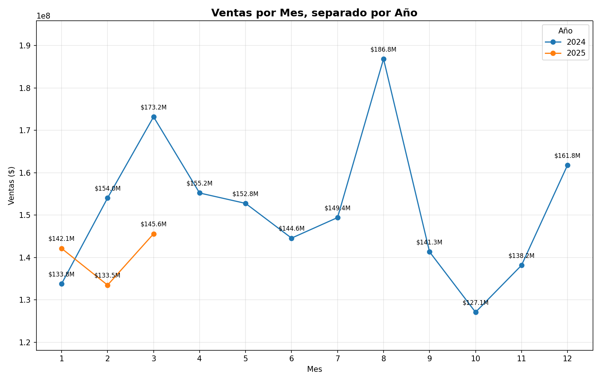
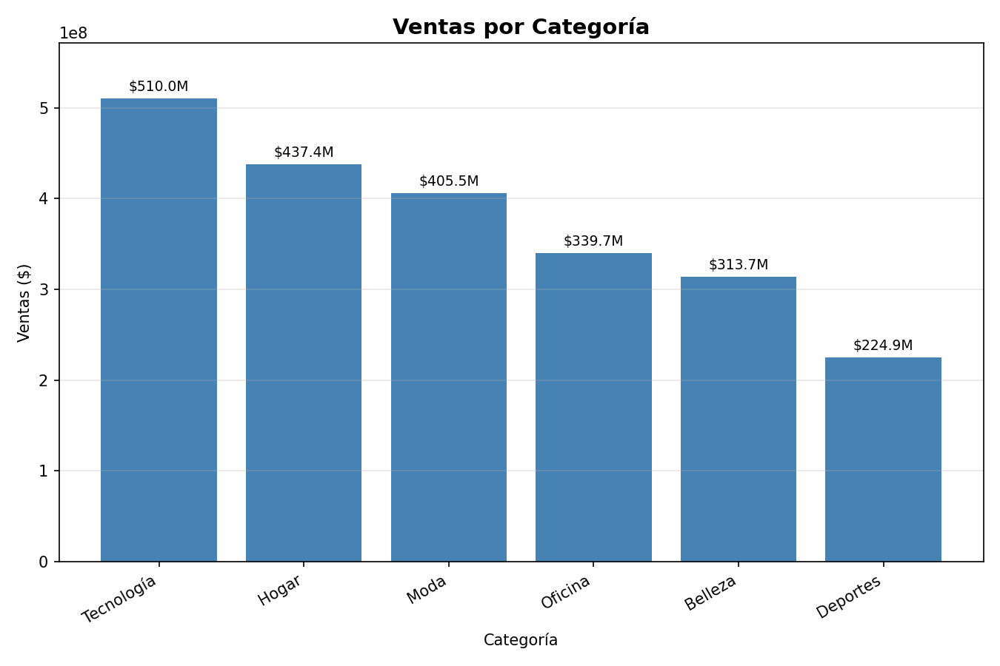
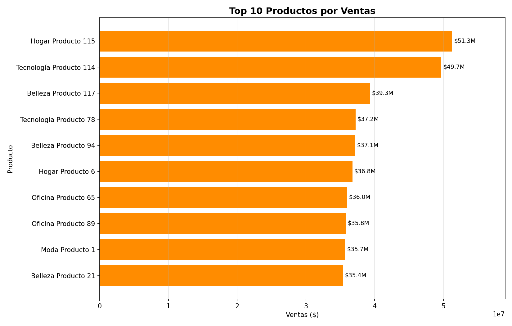
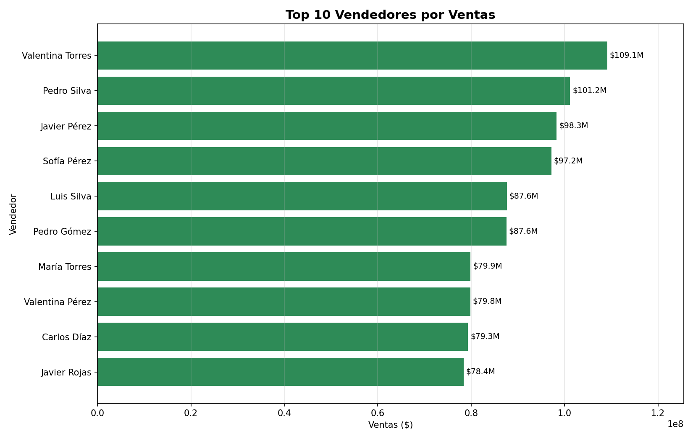
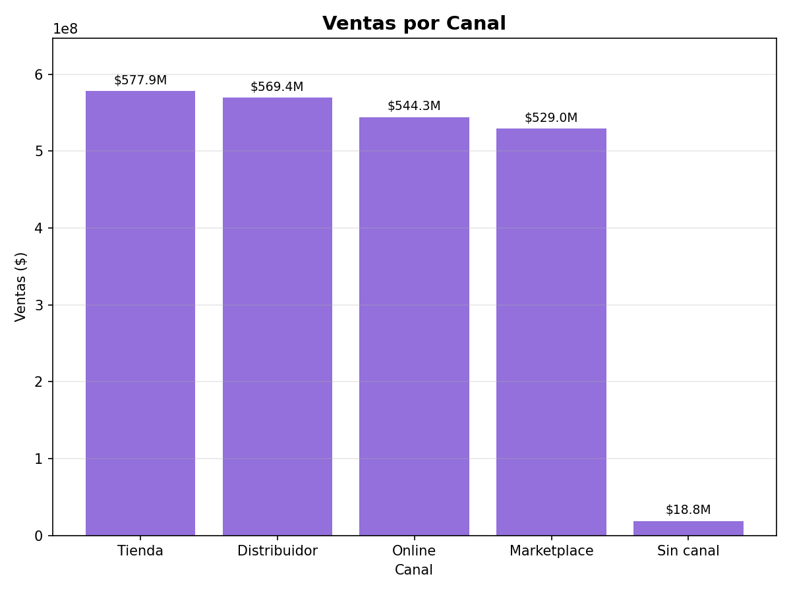
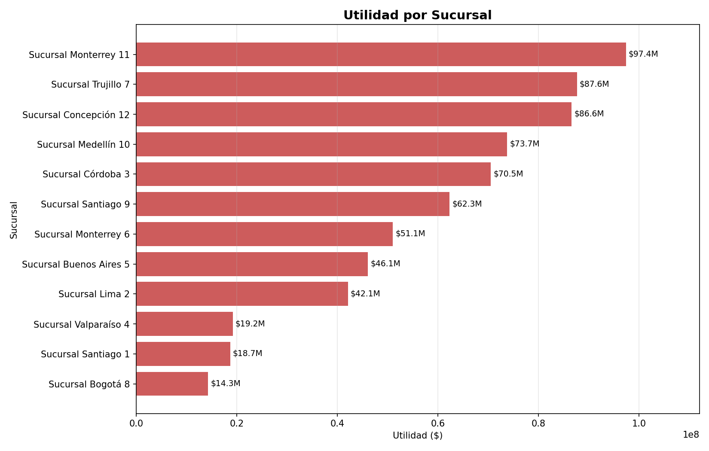
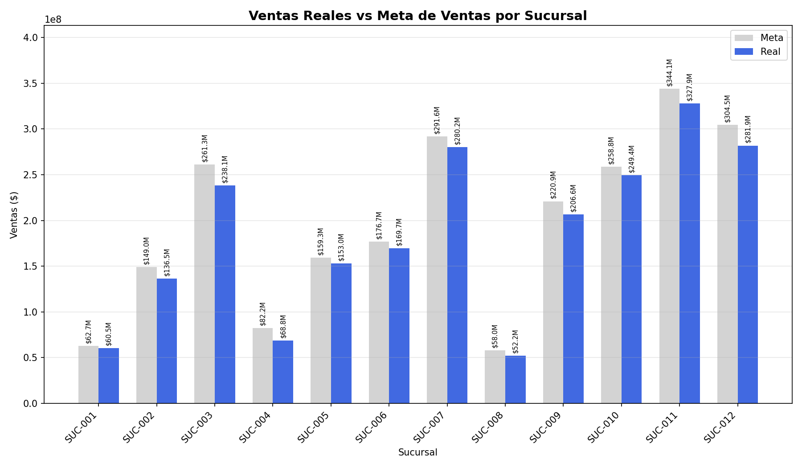
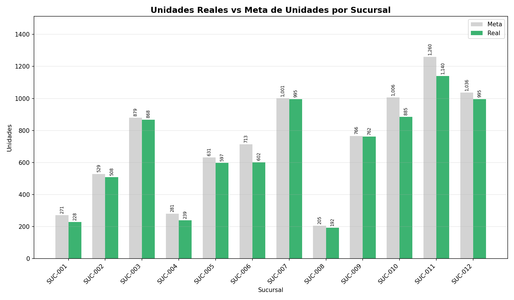

# Sistema de Análisis Comercial con Python

> Python · pandas · numpy · matplotlib · openpyxl · Google Colab

Proyecto final del curso de Analista de Datos (IPS Datax). Consiste en construir, de punta a punta, un sistema de análisis comercial: limpiar seis fuentes de datos con errores reales, unificarlas en una sola base analítica, calcular KPIs y métricas de negocio, evaluar el cumplimiento de metas por sucursal, generar visualizaciones y exportar un reporte final en Excel.

> Los datos utilizados son ficticios / simulados con fines de aprendizaje.

---

## 🎯 Objetivo

Desarrollar un sistema en Python capaz de cargar múltiples archivos Excel, limpiar información con errores reales, transformar datos, generar KPIs, crear visualizaciones y automatizar el proceso de análisis, simulando un escenario empresarial real. El principio rector de la limpieza fue **no eliminar información innecesariamente**: siempre que fue posible, los datos se corrigieron, reconstruyeron, imputaron o estandarizaron en lugar de descartarse.

---

## 🛠️ Stack Tecnológico

| Herramienta / Librería | Uso en el proyecto |
|---|---|
| Python 3 | Lenguaje principal |
| pandas | Carga, limpieza, unificación y transformación de los 6 datasets |
| numpy | Manejo de valores nulos y condiciones numéricas |
| re (regex) | Extracción y estandarización de IDs y patrones de texto |
| matplotlib | Generación de las 8 visualizaciones del proyecto |
| openpyxl | Exportación del reporte final a Excel (múltiples hojas) |
| Google Colab | Entorno de desarrollo |

---

## 📁 Estructura del Repositorio

```
sistema-analisis-comercial-python/
├── Proyecto_Avanzado_Python.ipynb   ← Notebook con limpieza, análisis y visualizaciones
├── dataset/                          ← Archivos originales (con errores)
│   ├── 01_ventas.xlsx
│   ├── 02_clientes.xlsx
│   ├── 03_productos.xlsx
│   ├── 04_vendedores.xlsx
│   ├── 05_sucursales.xlsx
│   └── 06_metas.xlsx
├── graficos/
│   ├── 01_ventas_por_mes_por_anio.png
│   ├── 02_ventas_por_categoria.png
│   ├── 03_top10_productos.png
│   ├── 04_top10_vendedores.png
│   ├── 05_ventas_por_canal.png
│   ├── 06_utilidad_por_sucursal.png
│   ├── 07_ventas_reales_vs_meta.png
│   └── 08_unidades_reales_vs_meta.png
└── output/                           ← Resultados generados por el notebook
    ├── 01_ventas_limpio.xlsx
    ├── 02_clientes_limpio.xlsx
    ├── 03_productos_limpio.xlsx
    ├── 04_vendedores_limpio.xlsx
    ├── 05_sucursales_limpio.xlsx
    ├── 06_metas_limpio.xlsx
    ├── base_analitica_final.xlsx
    ├── base_analitica_transformada.xlsx
    ├── tablas_resumen.xlsx
    ├── cumplimiento_metas.xlsx
    └── reporte_final_analisis_comercial.xlsx   ← Reporte consolidado (todas las hojas en un solo archivo)
```

> 💡 `reporte_final_analisis_comercial.xlsx` ya incluye, en hojas separadas, todo lo que hay en `tablas_resumen.xlsx`, `cumplimiento_metas.xlsx` y las bases analíticas. Si prefieres un repositorio más liviano, puedes subir solo ese archivo final a `output/` y dejar los demás como opcionales — ambas formas son válidas, es cuestión de qué tan detallado quieras mostrar el proceso.

---

## 📦 Dataset

El proyecto integra 6 archivos fuente en un modelo de estrella (1 tabla de hechos + 5 tablas de dimensión):

| Archivo | Filas válidas finales | Rol | Descripción |
|---|---|---|---|
| `01_ventas.xlsx` | 1,800 | Tabla de hechos | Transacciones: fecha, IDs relacionados, cantidad, precio, descuento, total |
| `02_clientes.xlsx` | 400 | Dimensión | País, ciudad, segmento, estado |
| `03_productos.xlsx` | 120 | Dimensión | Categoría, marca, costo y precio de lista |
| `04_vendedores.xlsx` | 30 | Dimensión | Vendedor, sucursal asignada y nivel |
| `05_sucursales.xlsx` | 12 | Dimensión | País, ciudad, zona, estado |
| `06_metas.xlsx` | 192 | Dimensión | Metas mensuales de ventas y unidades por sucursal |

---

## 🧹 Limpieza de Datos

Cada archivo tuvo su propio conjunto de problemas y su propio criterio de solución. Estos son los resultados reales obtenidos al ejecutar el notebook:

### `06_metas`
- 2 duplicados eliminados (quedan 192 filas).
- `SucursalID` y `Fecha` reconstruidas completamente por posición: la tabla está ordenada en bloques de 16 filas por sucursal (SUC-001 a SUC-012), con meses consecutivos de enero 2024 a abril 2025, por lo que ambas columnas se reconstruyeron desde cero siguiendo esa lógica.
- `Meta_Ventas` y `Meta_Unidades` convertidas a numérico; los valores inválidos (vacíos, negativos, cero o fuera de rango vía IQR) se imputaron con el **promedio de la misma sucursal** (19 y 15 valores respectivamente).

### `05_sucursales`
- 1 zona inválida detectada (SUC-011): reemplazada por "Sur", usando como criterio que comparte ciudad (Monterrey) con otra sucursal de esa zona — no se usó la moda global.
- No se eliminó ninguna fila.

### `04_vendedores`
- 2 nombres estandarizados y 1 valor faltante en `Nivel` reemplazado por `"Sin nivel"`.
- Se mantuvieron los 30 vendedores.

### `03_productos`
- 2 duplicados eliminados (quedan 120 filas).
- `Producto` y `Categoria` reconstruidos de forma **cruzada**: si el nombre del producto trae una categoría válida (ej. "Tecnología Producto 15"), esta manda sobre la categoría guardada; si falta el nombre pero existe la categoría, se reconstruye como `Categoría + "Producto" + número`. Esto corrigió 4 categorías inconsistentes y reconstruyó 1 nombre de producto.
- `Marca` y `Estado` inválidos o faltantes reemplazados por `"Sin marca"` / `"Sin dato"` (4 y 2 casos).
- `Costo_Unitario` y `Precio_Lista` convertidos a numérico; outliers detectados con IQR. Para completar valores faltantes se calculó el ratio promedio Costo/Precio sobre los 117 registros 100% válidos (**64.24%**) y se usó para estimar el valor faltante en cada dirección (2 costos y 1 precio imputados así).

### `02_clientes`
- 6 duplicados eliminados (quedan 400 filas).
- `ClienteID` reconstruido desde el nombre en 7 filas.
- Columnas de texto (`Cliente`, `País`, `Ciudad`) normalizadas.
- `Segmento` y `Estado` inválidos o faltantes reemplazados por la moda global (`"B2C"` y `"Activo"`, 8 y 3 casos).

### `01_ventas`
- 27 duplicados eliminados (quedan 1,800 filas).
- `VentaID` reconstruido: los 12 valores irrecuperables se completaron con la numeración faltante de la secuencia VTA-00001 a VTA-01800 (se verificó que la cantidad coincidía exactamente).
- `Fecha` convertida a datetime; 22 faltantes completados con la mediana de la serie.
- IDs de relación (`ClienteID`, `ProductoID`, `VendedorID`, `SucursalID`) estandarizados por regex; los irrecuperables se marcaron como `"Sin dato"` en vez de inventar una relación (entre 6 y 13 casos por columna).
- `Canal` y `Metodo_Pago` inválidos reemplazados por `"Sin canal"` / `"Sin método de pago"` (14 casos cada uno).
- `Cantidad` inválida (texto, negativos, cero, outliers IQR) imputada con la mediana (20 casos).
- `Precio_Unitario` reconstruido completamente desde el catálogo de productos (1,794 filas via merge por `ProductoID`; 6 filas sin catálogo resoluble mantuvieron su valor original).
- `Descuento` fuera del rango [0, 0.2] o no interpretable se llevó a 0 (5 casos) — decisión conservadora, no se usó un promedio.
- `Total_Venta` recalculado desde cero: `Precio_Unitario × Cantidad × (1 − Descuento)`.

### Ejemplo de código: reconstrucción por bloques (`SucursalID` + `Fecha` en metas)

```python
fechas_bloque = pd.date_range("2024-01-01", periods=MESES_POR_SUCURSAL, freq="MS")
sucursales, fechas = [], []
for i in range(N_SUCURSALES):
    sucursales.extend([f"SUC-{i+1:03d}"] * MESES_POR_SUCURSAL)
    fechas.extend(fechas_bloque)

df["SucursalID"] = sucursales
df["Fecha"] = fechas
```

### Ejemplo de código: parseo de descuentos con corrección de formato

```python
def parsear_descuento(valor):
    if pd.isna(valor):
        return np.nan
    s = str(valor).strip()
    tiene_signo_pct = "%" in s
    s_limpio = s.replace("%", "").strip()
    numero = float(s_limpio)
    # un numero > 1 solo tiene sentido como porcentaje, aunque no traiga el símbolo '%'
    if tiene_signo_pct or numero > 1:
        return numero / 100
    return numero
```

---

## 🔗 Unificación y Transformación

- **Modelo de estrella:** `merge(how="left")` encadenado desde `ventas` (tabla ancla) hacia `clientes`, `productos`, `vendedores` y `sucursales`, para conservar las 1,800 ventas aunque alguna llave foránea no sea reconciliable.
- **Columnas ambiguas renombradas antes del merge** (`Estado`, `Ciudad`, `Pais`/`País`, `SucursalID` se repetían en varias tablas con significados distintos), evitando sufijos automáticos poco claros. Por ejemplo, el `SucursalID` de vendedores se renombró a `SucursalID_Vendedor` para no confundirlo con la sucursal real de la venta.
- Base final: **1,800 filas × 32 columnas** tras la unión.
- **Métricas comerciales creadas:** columnas de tiempo (`Año`, `Mes`, `Trimestre`, `DiaSemana`, `EsFinDeSemana`), `Venta_Bruta`, `Venta_Neta`, `Costo_Total`, `Utilidad` y `Margen_%` — base transformada final de **1,800 filas × 43 columnas**.
- Para las 6 ventas sin `Costo_Unitario` conocido, el costo se imputó con el ratio promedio Costo/Precio (64.20%) sobre `Precio_Unitario`.

---

## 📋 KPIs Principales

| Métrica | Valor |
|---|---|
| Ventas Totales | $ 2,239,416,568 |
| Utilidad Total | $ 674,373,176 |
| Margen Promedio (simple) | 29.50 % |
| Margen Promedio (ponderado) | 30.11 % |
| Cantidad Vendida | 8,073 unidades |
| Número de Ventas | 1,800 |
| Ticket Promedio | $ 1,244,120.32 |
| Descuento Promedio | 8.30 % |

**Hallazgos por dimensión:**
- **Categoría líder:** Tecnología ($510.0 M en ventas); Deportes es la más baja ($224.9 M).
- **País líder:** Chile ($617.81 M).
- **Producto líder:** Hogar Producto 115 ($51.28 M).
- **Vendedora líder:** Valentina Torres ($109.12 M).
- **Sucursal con mayor utilidad:** SUC-011, Sucursal Monterrey 11 ($97.38 M).
- **Canal más débil:** "Sin canal" representa apenas $18.8 M (2.4% del total), producto de datos originales inválidos que no se pudieron reconciliar.

---

## 🎯 Cumplimiento de Metas

Se comparó, por sucursal y mes, la meta de ventas/unidades contra lo realmente vendido (excluyendo 11 ventas sin sucursal identificable). La sucursal con mejor cumplimiento de ventas fue **SUC-001 (96.58%)**, y en general la mayoría de las sucursales se mantuvo entre 91% y 97% de cumplimiento respecto a su meta de ventas.

---

## 📊 Visualizaciones

Se generaron 8 gráficos con matplotlib, guardados automáticamente en la carpeta `graficos/`.

**Ventas por mes, separado por año** — agosto 2024 marca el pico del período ($186.8M); el patrón mensual de 2025 (solo 3 meses disponibles) es consistente con el cierre de 2024.



**Ventas por categoría** — Tecnología lidera con $510.0M, casi el doble que Deportes, la categoría más baja ($224.9M).



**Top 10 productos** — Hogar Producto 115 es el más vendido ($51.3M), seguido de cerca por Tecnología Producto 114 ($49.7M).



**Top 10 vendedores** — Valentina Torres lidera con $109.1M, por encima de Pedro Silva ($101.2M) y Javier Pérez ($98.3M).



**Ventas por canal** — Tienda, Distribuidor, Online y Marketplace están parejos (entre $529M y $578M); "Sin canal" agrupa solo el 2.4% del total, producto de datos originales no reconciliables.



**Utilidad por sucursal** — Sucursal Monterrey 11 genera la mayor utilidad ($97.4M), mientras que Sucursal Bogotá 8 es la más baja ($14.3M).



**Ventas reales vs. meta de ventas** — la mayoría de las sucursales se acerca bastante a su meta (ej. SUC-007: $280.2M reales vs $291.6M meta); ninguna la supera.



**Unidades reales vs. meta de unidades** — mismo patrón: cumplimiento alto pero consistentemente por debajo de la meta en todas las sucursales.



---

## 📤 Exportación de Resultados

Todo el análisis se consolidó en un único archivo Excel (`reporte_final_analisis_comercial.xlsx`) con 11 hojas, validadas una por una al finalizar el proceso:

| Hoja | Dimensiones |
|---|---|
| Base_Analitica_Final | 1,800 × 43 |
| KPIs | 8 × 2 |
| Ventas_Mes | 15 × 6 |
| Ventas_Categoria | 6 × 5 |
| Ventas_Pais | 5 × 4 |
| Ventas_Canal | 5 × 4 |
| Top_Productos | 10 × 5 |
| Top_Vendedores | 10 × 5 |
| Utilidad_Sucursal | 12 × 6 |
| Cumplimiento_Metas | 12 × 7 |
| Cumplimiento_Metas_Detalle | 192 × 12 |

---

## ⚙️ Técnicas de Python Aplicadas

- Exploración con `.shape`, `.info()`, `.duplicated()`, `.isnull().sum()`, `.unique()`
- Eliminación de duplicados exactos con `.drop_duplicates()`
- Reconstrucción de estructuras por bloques combinando `pd.date_range()` con bucles
- Conversión robusta a numérico con `pd.to_numeric(errors="coerce")`
- Detección de outliers con la regla del rango intercuartílico (IQR)
- Imputación contextual con `groupby()` (promedio por sucursal, no promedio general)
- Extracción de patrones con expresiones regulares (`re.search`, `re.compile`)
- Funciones propias para casos límite, aplicadas con `.apply()`
- Unificación de tablas con `merge(how="left")` encadenado y renombrado explícito de columnas ambiguas
- Creación de columnas de tiempo con el accesor `.dt`
- Gráficos con `ax.bar()`, `ax.barh()`, `ax.plot()`
- Exportación multi-hoja con `pd.ExcelWriter(engine="openpyxl")`

---

## 🧠 Conclusiones y Aprendizajes

El desafío principal del proyecto no fue el código en sí, sino **decidir el criterio correcto para cada tipo de error** sin perder información: usar el promedio de un grupo cuando había una relación estadística clara (como el ratio costo/precio en productos), pero usar un placeholder explícito cuando no había base para inventar una tendencia (como la zona de una sucursal inactiva). También fue clave no inventar relaciones al estandarizar llaves foráneas: si un ID no era reconciliable, se dejó como "Sin dato" en vez de asignarlo arbitrariamente, aunque eso implique que el cumplimiento de metas pueda estar levemente subestimado en los casos donde 11 ventas no lograron asociarse a una sucursal.

---

*Proyecto desarrollado como parte de mi portafolio de análisis de datos.*
